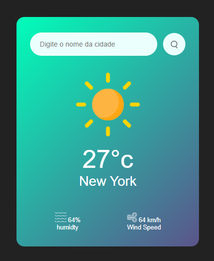

# 🌤️ Weather App

Aplicação web de previsão do tempo onde o usuário digita o nome de uma cidade e recebe as condições climáticas atuais: **temperatura**, **umidade** e **velocidade do vento**.

🔗 **Acesse o projeto:** [https://SEU-USUARIO.github.io/NOME-DO-REPOSITORIO/](https://SEU-USUARIO.github.io/NOME-DO-REPOSITORIO/)

---

## 📸 Preview



---

## ✨ Funcionalidades

- 🔍 Busca por nome da cidade
- 🌡️ Exibição da temperatura atual (°C)
- 💧 Exibição da umidade do ar (%)
- 💨 Exibição da velocidade do vento (km/h)
- 🖼️ Troca automática do ícone conforme as condições do clima
- 🎨 Interface com fundo em degradê e layout em formato de card

---

## 🛠️ Tecnologias utilizadas

- **HTML5** – estrutura da página
- **CSS3** – estilização e layout
- **JavaScript (ES6+)** – lógica da aplicação e consumo da API
- **API de clima** (OpenWeatherMap) – fonte dos dados meteorológicos

---

## 📁 Estrutura do projeto

```
├── .vscode/
├── images/        # Ícones do clima e imagens do projeto
├── js/            # Scripts da aplicação
├── index.html     # Página principal
└── style.css      # Estilos
```

---

## 🚀 Como executar localmente

1. Clone o repositório:

   ```bash
   git clone https://github.com/SEU-USUARIO/NOME-DO-REPOSITORIO.git
   ```

2. Acesse a pasta do projeto:

   ```bash
   cd NOME-DO-REPOSITORIO
   ```


3. Abra o `index.html` no navegador (ou use a extensão **Live Server** do VS Code).

---

## 📖 Como usar

1. Digite o nome da cidade no campo de busca.
2. Clique no botão de pesquisa (🔍).
3. Veja a temperatura, a umidade e a velocidade do vento da cidade pesquisada.

---

## 👤 Autor

Feito por **SEU NOME** – [GitHub](https://github.com/SEU-USUARIO)
